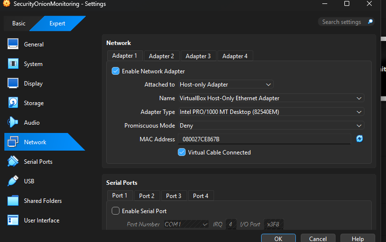
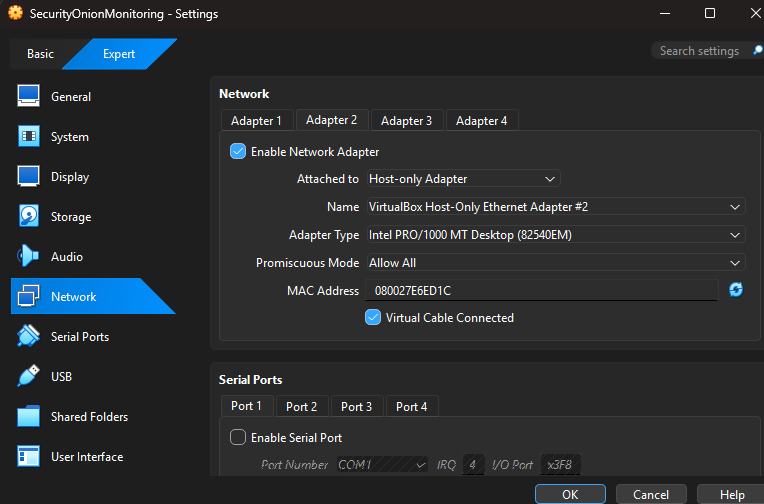
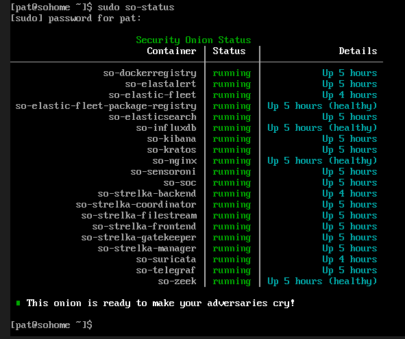
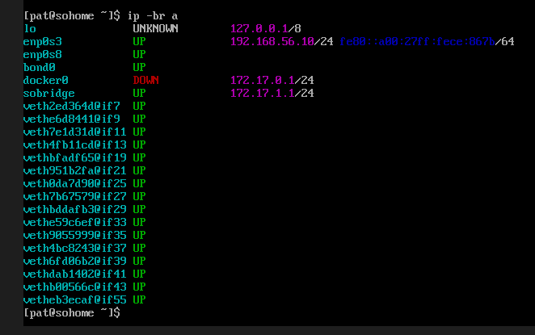
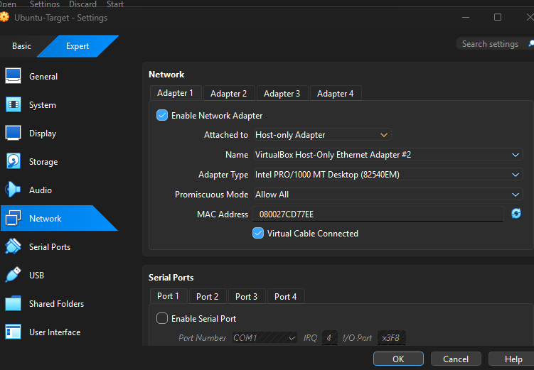
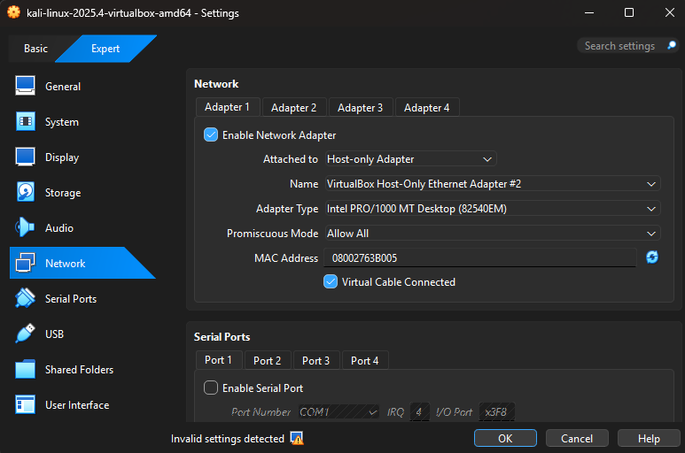

# Security Onion SOC Home Lab

A hands-on blue-team lab built in **Oracle VirtualBox** using **Security Onion 2.4.201**, **Kali Linux**, and **Ubuntu**.

The lab was designed to simulate attacker-to-victim network activity, monitor that traffic with Security Onion, validate **Suricata detections**, and investigate alerts using **Alerts, Dashboards, Hunt, and PCAP evidence**.


## Project Overview

The goal of this project was to build a small but realistic SOC environment where I could:

* Configure a dedicated monitoring platform
* Generate controlled attacker traffic
* Monitor attacker-to-victim communications
* Validate network-based detections
* Investigate Suricata alerts
* Review supporting packet evidence
* Practise structured SOC investigation workflows
* Troubleshoot networking and visibility issues

A major part of the project involved troubleshooting the environment until Security Onion had visibility into the correct network segment.

## Lab Architecture

```text
                    Management Network
                           |
                           |
                 Security Onion 2.4.201
                 Management: 192.168.56.10
                 NIC: enp0s3
                           |
                 Monitoring: enp0s8
                           |
                         bond0
                           |
              Monitored Network 10.10.10.0/24
                           |
              +------------+------------+
              |                         |
              |                         |
        Kali Linux                 Ubuntu
        Attacker                   Victim
        10.10.10.20                10.10.10.30
                                        |
                                  HTTP Server
                                    Port 8000
```

### Traffic Flow

```text
Kali Linux → Ubuntu Victim → Monitored by Security Onion
```

## Lab Environment

### Lab Environment Screenshots





| Component                    | Configuration          |
| ---------------------------- | ---------------------- |
| Host System                  | Windows                |
| Virtualisation               | Oracle VirtualBox      |
| Monitoring Platform          | Security Onion 2.4.201 |
| Attacker                     | Kali Linux             |
| Victim                       | Ubuntu Desktop         |
| IDS / Detection              | Suricata               |
| Security Onion Management IP | `192.168.56.10/24`     |
| Kali IP                      | `10.10.10.20/24`       |
| Ubuntu IP                    | `10.10.10.30/24`       |
| Management NIC               | `enp0s3`               |
| Monitoring NIC               | `enp0s8`               |
| Monitoring Interface         | `bond0`                |

## Network Configuration

Security Onion used separate interfaces for management and monitoring.

```text
Management
enp0s3
192.168.56.10/24

Monitoring
enp0s8
↓
bond0
```

This separation was important because my initial testing against Security Onion's management interface did not generate the detections I expected.

I learned that successfully deploying a SIEM or IDS does not automatically mean it has visibility into the traffic that matters.

The monitored traffic needed to travel across the correct network segment.

## Security Onion Deployment Verification

After rebuilding Security Onion with the correct network design, I verified the platform using:

```bash
sudo so-status
ip -br a
```

I confirmed that the core services were running, the management interface had `192.168.56.10/24`, `bond0` was active, and the system was ready to monitor traffic.





## Ubuntu Victim Configuration

Ubuntu was configured as the target system:

```text
IP Address: 10.10.10.30/24
Interface: enp0s3
```

### Ubuntu Victim



Example configuration:

```bash
sudo nmcli connection mod "Wired connection 1" ipv4.method manual ipv4.addresses 10.10.10.30/24 ipv6.method ignore

sudo nmcli connection down "Wired connection 1"

sudo nmcli connection up "Wired connection 1"
```

A simple Python HTTP server was then started:

```bash
python3 -m http.server 8000
```

This created a service that could be accessed and scanned from Kali.

## Kali Attacker Configuration

Kali Linux was configured as the attacker system:

```text
IP Address: 10.10.10.20/24
Interface: eth0
```

### Kali Attacker



Example configuration:

```bash
sudo ip addr add 10.10.10.20/24 dev eth0

sudo ip link set eth0 up

ip -br a

ip route
```

## Traffic Generation

After validating connectivity between Kali and Ubuntu, I generated several types of controlled network activity.

### ICMP Testing

```bash
ping -c 4 10.10.10.30
```

### HTTP Request

```bash
curl http://10.10.10.30:8000/
```

### Nmap Service Detection

```bash
nmap -sV -p 8000 10.10.10.30
```

### Nmap Reconnaissance

```bash
nmap -A 10.10.10.30
```

These tests generated traffic associated with:

* ICMP
* HTTP
* curl
* Service enumeration
* Nmap scripting
* OS detection
* Network reconnaissance

## Detection Results

Security Onion successfully detected the generated activity through Suricata.

Alerts observed included:

```text
ET INFO Python SimpleHTTP ServerBanner

ET SCAN Nmap Scripting Engine User-Agent Detected

ET SCAN Possible Nmap User-Agent Observed

GPL ICMP PING *NIX

ET HUNTING curl User-Agent to Dotted Quad

ET SCAN NMAP OS Detection Probe
```

The environment also generated multiple scanning and reconnaissance-related alerts.

## Alert Investigation

One alert I investigated in more detail was:

```text
ET SCAN Nmap Scripting Engine User-Agent Detected
```

The associated traffic showed:

```text
Source IP:        10.10.10.20
Destination IP:   10.10.10.30
Destination Port: 8000
Interface:        bond0
Protocol:         HTTP

HTTP Request:
OPTIONS / HTTP/1.1

User-Agent:
Nmap Scripting Engine
```

The evidence correlated directly with the Nmap activity generated from the Kali attacker machine.

## Analyst Assessment

I classified the activity as:

**Suspicious reconnaissance / service enumeration**

The activity showed active probing of a network service but, by itself, was not evidence that the victim had been compromised.

In a real SOC investigation, useful pivots would include:

* Source IP
* Destination IP
* Destination port
* Community ID
* Related Suricata alerts
* Related HTTP activity
* Packet capture
* Other activity from the same source

## Troubleshooting

The project did not work perfectly on the first attempt.

Some of the issues I worked through included:

* Incorrect interface assignments
* VirtualBox network configuration
* Monitoring the wrong network path
* Guest connectivity problems
* Security Onion deployment configuration
* Attempting to scan the management interface instead of the monitored network
* Confirming routes and interface states
* Rebuilding the environment when the original configuration became unnecessarily complex

One of the most important lessons from the project was:

> A security monitoring platform can be functioning correctly and still detect nothing if it does not have visibility into the relevant traffic.

## Investigation Workflow

The workflow I followed was:

```text
Generate Activity
      ↓
Confirm Connectivity
      ↓
Security Onion Receives Traffic
      ↓
Suricata Detection
      ↓
Review Alert
      ↓
Pivot on Source / Destination
      ↓
Review Hunt Data
      ↓
Inspect Packet Evidence
      ↓
Determine Activity Context
```

## Skills Demonstrated

This project gave me practical experience with:

* Security Onion
* Suricata
* SOC monitoring
* Network traffic analysis
* Alert triage
* Network reconnaissance detection
* Nmap
* Kali Linux
* Ubuntu Linux
* VirtualBox
* TCP/IP networking
* Linux network configuration
* IDS alert validation
* PCAP investigation
* Evidence correlation
* Troubleshooting
* Analyst documentation

## Key Lessons

### Monitoring depends on architecture

Installing a monitoring platform is only part of the problem. The platform must have visibility into the network path containing the activity being investigated.

### Validate connectivity before investigating alerts

Before assuming that an IDS is failing, validate:

```text
IP addressing
Interface state
Routing
Service availability
Traffic path
```

### Separate attacker, victim, and monitoring roles

Using separate systems made the environment more realistic and made the resulting telemetry easier to understand.

### Troubleshooting is part of security operations

Working through interface, routing, deployment, and visibility issues gave me a better understanding of the telemetry Security Onion relies on.

## Final Outcome

By the end of the project, I had a functioning virtual SOC environment consisting of:

```text
Security Onion → Monitoring and detection
Kali Linux     → Attacker simulation
Ubuntu         → Victim system
Suricata       → Network detections
```

The environment successfully captured and detected:

* Ping activity
* HTTP requests
* curl traffic
* Nmap reconnaissance
* Service/version detection
* Nmap scripting activity
* OS detection probes

The project strengthened my understanding of how **network architecture, telemetry, detection logic, and analyst investigation workflows work together in a SOC environment**.

## Project Date

**March 2026**

## Author

**Patrick Abou Nakoul**

Cybersecurity Portfolio: [patrickabounakoul.com](https://patrickabounakoul.com/)
